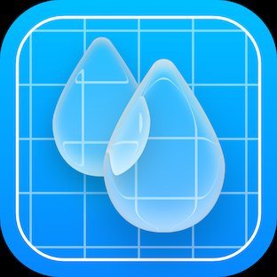

<div align="center">
  
</div>

# 🎬 DripDrop Frontend

> **A new 12-second video platform that pays, on-chain.**

DripDrop is an innovative short-form video platform built on blockchain technology, designed to reward creators and viewers through on-chain transactions. This repository contains the frontend application for the DripDrop coming soon landing page.

[](https://nextjs.org/)
[](https://www.typescriptlang.org/)
[](https://tailwindcss.com/)

## 🌟 About DripDrop

DripDrop revolutionizes the short-form video space by creating a platform where:
- **Creators** earn cryptocurrency for their 12-second videos
- **Viewers** are rewarded for engagement and interaction
- **Content** is monetized through transparent on-chain mechanisms
- **Community** drives value through decentralized participation

**Current Status:** 🚧 Pre-launch - Collecting early user signups

## ✨ Features

### 🎯 **Current Landing Page Features**
- **Email Signup Collection** - Integrated with SendGrid for automated welcome emails
- **Launch Countdown Timer** - Real-time countdown to platform launch
- **Responsive Design** - Optimized for all device sizes
- **Dark/Light Theme** - Automatic theme switching with user preference persistence
- **Smooth Animations** - GSAP-powered hero animations and transitions
- **Cookie Consent** - GDPR-compliant cookie management
- **Analytics Integration** - Google Analytics for user behavior tracking

### 🔮 **Upcoming Platform Features**
- 12-second video creation and sharing
- On-chain rewards and payments
- Creator monetization tools
- Social engagement features
- Blockchain-based content verification

## 🛠️ Tech Stack

### **Frontend Framework**
- **Next.js 15.4.4** - React framework with App Router
- **TypeScript 5.8.3** - Type-safe development
- **React 18.2.0** - Component-based UI library

### **Styling & UI**
- **Tailwind CSS 3.3.3** - Utility-first CSS framework
- **Radix UI** - Accessible component primitives
- **Lucide React** - Beautiful SVG icons
- **next-themes** - Theme switching functionality

### **Animations & Interactions**
- **GSAP 3.13.0** - Professional animation library
- **Framer Motion 12.23.9** - React animation library

### **Blockchain Integration**
- **MySocial Network** - Blockchain infrastructure
- **Apollo Client 3.13.8** - GraphQL client (prepared for future use)
- **bip39** - Mnemonic code utilities

### **Email & Analytics**
- **SendGrid** - Email delivery and automation
- **Google Analytics** - User behavior tracking
- **React Hook Form** - Form validation and handling

### **Development Tools**
- **ESLint** - Code linting and formatting
- **PostCSS** - CSS processing
- **Nodemon** - Development server auto-restart

## 🚀 Quick Start

### Prerequisites
- **Node.js** 18.0.0 or higher
- **npm** or **yarn** package manager
- **Git** for version control

### Installation

1. **Clone the repository**
   ```bash
   git clone https://github.com/your-org/dripdrop-frontend.git
   cd dripdrop-frontend
   ```

2. **Install dependencies**
   ```bash
   npm install
   # or
   yarn install
   ```

3. **Set up environment variables**
   ```bash
   cp .env.example .env.local
   ```
   
   Configure the following variables in `.env.local`:
   ```env
   # MySocial Network Configuration
   NEXT_PUBLIC_MYS_FULLNODE=http://fullnode.testnet.mysocial.network:9000
   
   # SendGrid Configuration
   SENDGRID_API_KEY=your_sendgrid_api_key
   SENDGRID_FROM_EMAIL=your_from_email
   SENDGRID_TEMPLATE_ID=your_template_id
   
   # Google Analytics
   NEXT_PUBLIC_GA_ID=your_google_analytics_id
   ```

4. **Start the development server**
   ```bash
   npm run dev
   # or
   yarn dev
   ```

5. **Open your browser**
   Navigate to [http://localhost:3000](http://localhost:3000)

### Available Scripts

```bash
npm run dev          # Start development server
npm run build        # Build for production
npm run start        # Start production server
npm run lint         # Run ESLint
npm run dev:watch    # Start with nodemon auto-restart
```

## 📁 Project Structure

```
dripdrop-frontend/
├── app/                          # Next.js App Router
│   ├── api/                     
│   │   └── fullnode/            # MySocial blockchain proxy
│   ├── globals.css              # Global styles
│   ├── layout.tsx               # Root layout component
│   └── page.tsx                 # Landing page
├── components/                   # React components
│   ├── sections/                # Page sections
│   ├── ui/                      # Reusable UI components
│   ├── email-signup.tsx         # Email collection form
│   ├── countdown-timer.tsx      # Launch countdown
│   ├── footer.tsx               # Site footer
│   └── theme-provider.tsx       # Theme context
├── hooks/                       # Custom React hooks
│   ├── useGoogleAuth.ts         # Google authentication
│   ├── useUniversalAuth.ts      # Universal auth system
│   └── use-toast.ts             # Toast notifications
├── lib/                         # Utility libraries
│   ├── apollo-client.tsx        # GraphQL client setup
│   ├── sendgrid.ts              # Email service
│   ├── network-context.tsx      # Blockchain network context
│   └── utils.ts                 # Helper functions
├── public/                      # Static assets
└── package.json                 # Dependencies and scripts
```

### Key Files

- **`app/page.tsx`** - Main landing page with hero section, countdown, and email signup
- **`app/api/fullnode/route.ts`** - Blockchain proxy for MySocial network integration
- **`components/email-signup.tsx`** - Email collection with SendGrid integration
- **`lib/sendgrid.ts`** - Email automation and welcome messages
- **`next.config.js`** - Next.js configuration with static export

## ⚙️ Configuration

### Build Configuration

The project is configured for **static export** to support deployment on various hosting platforms:

```javascript
// next.config.js
const nextConfig = {
  output: 'export',           // Static site generation
  eslint: {
    ignoreDuringBuilds: true, // Skip lint during build
  },
  images: { unoptimized: true }, // Optimize for static export
};
```

### Theme Configuration

- **Default Theme:** Dark mode
- **Theme Persistence:** Local storage
- **System Theme:** Automatic detection
- **Theme Toggle:** Available in footer

### Email Integration

SendGrid is configured for:
- Welcome email automation
- Contact list management
- Template-based emails
- Error handling and validation

## 🚀 Deployment

### Static Export Build

```bash
npm run build
```

This creates an `out/` directory with static files ready for deployment.

### Deployment Platforms

The static export is compatible with:
- **Vercel** - Zero-config deployment
- **Netlify** - Drag and drop deployment
- **GitHub Pages** - Free static hosting
- **AWS S3** - Scalable static hosting
- **Any CDN** - Global content delivery

### Environment Variables

Ensure the following environment variables are configured in your deployment platform:

- `NEXT_PUBLIC_MYS_FULLNODE` - MySocial blockchain endpoint
- `SENDGRID_API_KEY` - SendGrid API authentication
- `SENDGRID_FROM_EMAIL` - Sender email address
- `NEXT_PUBLIC_GA_ID` - Google Analytics tracking ID

## 🤝 Contributing

We welcome contributions to improve the DripDrop frontend! Here's how to get started:

### Development Guidelines

1. **Code Style**
   - Use TypeScript for all new files
   - Follow existing naming conventions
   - Use Tailwind CSS for styling
   - Keep components small and focused

2. **Component Standards**
   - Use Radix UI primitives when available
   - Implement proper accessibility (ARIA labels, keyboard navigation)
   - Support both light and dark themes
   - Include proper TypeScript interfaces

3. **Testing**
   - Test components in both themes
   - Verify responsive design on multiple devices
   - Test email signup flow
   - Validate blockchain integration points

### Pull Request Process

1. Fork the repository
2. Create a feature branch (`git checkout -b feature/amazing-feature`)
3. Commit your changes (`git commit -m 'Add amazing feature'`)
4. Push to the branch (`git push origin feature/amazing-feature`)
5. Open a Pull Request

## 📚 Additional Resources

- **[MySocial Network Documentation](https://www.mysocial.network/MySocial.pdf)** - Blockchain infrastructure details
- **[Next.js Documentation](https://nextjs.org/docs)** - Framework reference
- **[Tailwind CSS](https://tailwindcss.com/docs)** - Styling utilities
- **[Radix UI](https://www.radix-ui.com/)** - Component primitives

## 📄 License

This project is proprietary software. All rights reserved.

## 🔗 Links

- **Website:** Coming Soon
- **Documentation:** This README
- **Issues:** [GitHub Issues](https://github.com/your-org/dripdrop-frontend/issues)
- **Discussions:** [GitHub Discussions](https://github.com/your-org/dripdrop-frontend/discussions)

---

**Built with ❤️ for the future of decentralized video content creation.** 